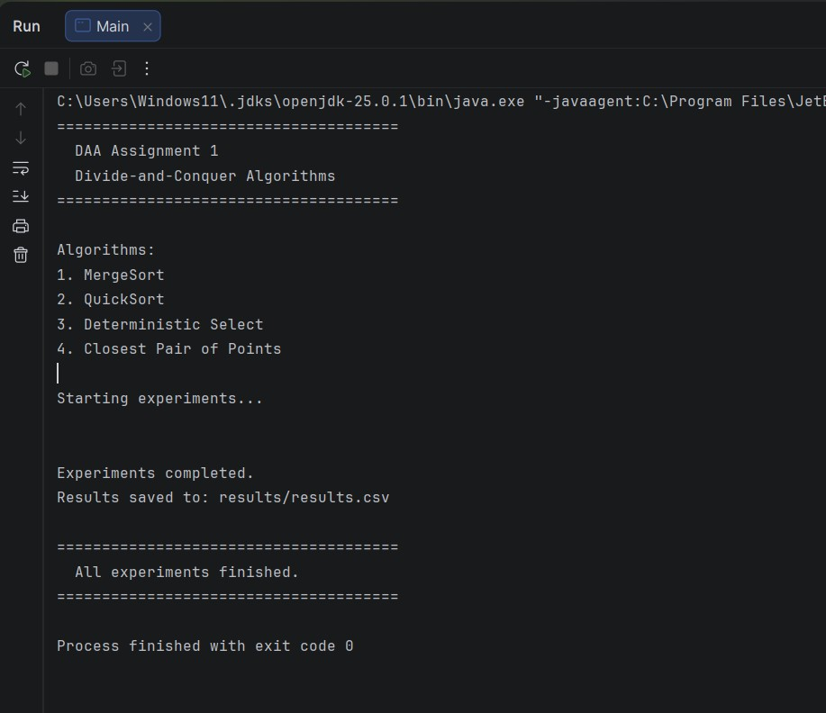
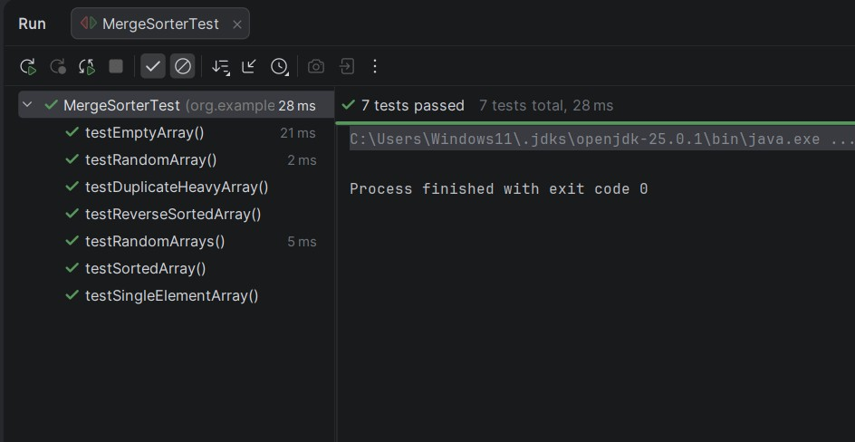
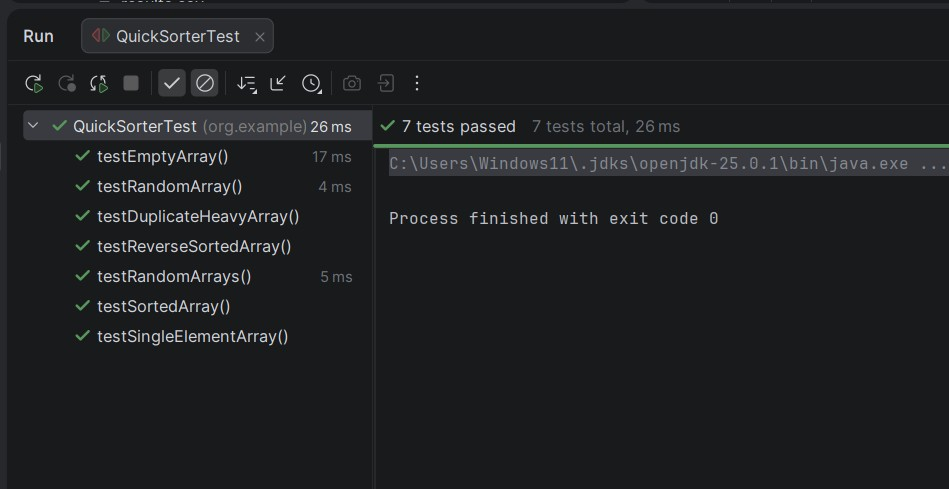
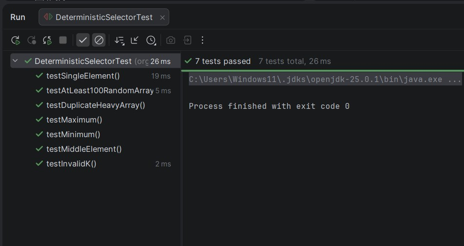
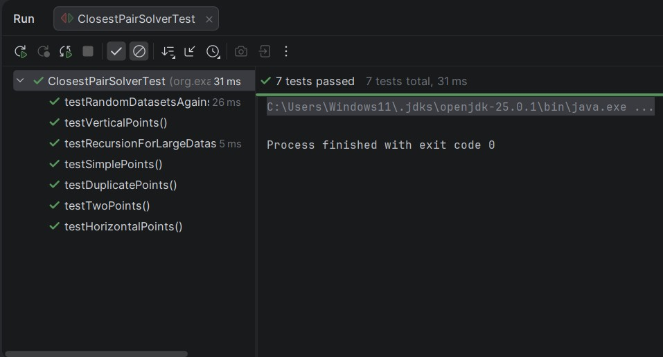
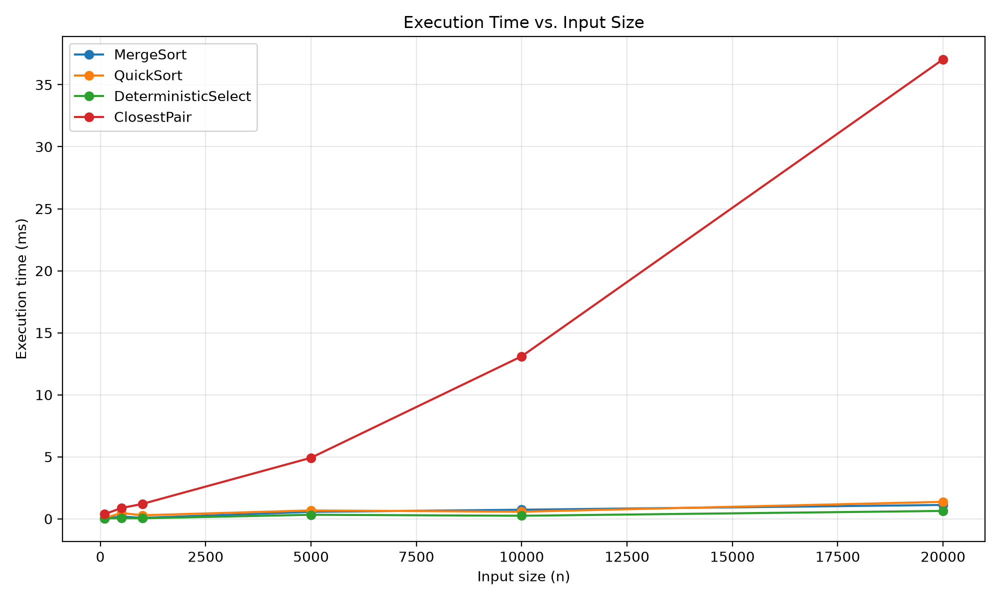
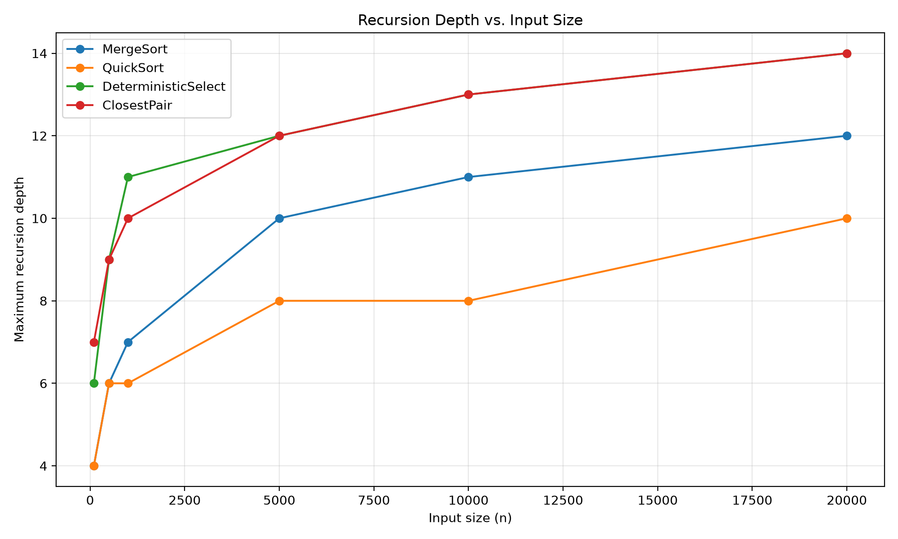
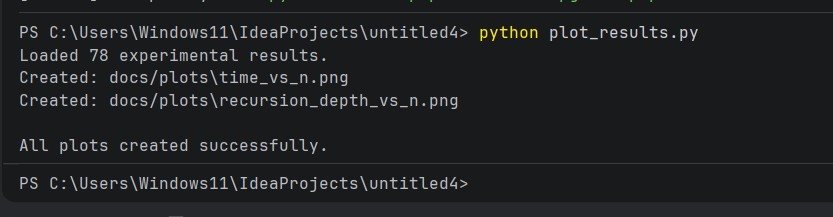

# Assignment 1: Divide-and-Conquer Algorithm Analysis

## A. Project Overview

This project presents a theoretical and empirical analysis of four classic Divide-and-Conquer algorithms implemented in Java:

- **MergeSort:** `Θ(nlog n)` sorting algorithm with a reusable auxiliary buffer and small-input cutoff.
- **QuickSort:** In-place randomized pivot sorting with smaller-first recursion.
- **Deterministic Select (Median-of-Medians):** Worst-case linear-time `Θ(n)` selection algorithm.
- **Closest Pair of Points:** Divide-and-conquer algorithm for finding the closest pair of 2D points in `Θ(nlog n)` time.

The project also includes automated correctness tests, performance measurements, recursion-depth tracking, CSV result storage, and performance plots.

---

## B. Algorithm Analysis

### 1. MergeSort

- **Mechanism:** Recursively divides the array into two halves, sorts both halves, and merges them using one reusable auxiliary buffer. Small sub-arrays use Insertion Sort to reduce recursion overhead.
- **Recurrence:** `T(n)=2T(n/2)+Θ(n)`
- **Master Theorem:** Case 2 applies, giving `T(n)=Θ(nlog n)`.
- **Space Complexity:** `O(n)` for the auxiliary buffer and `O(log n)` recursion depth.

### 2. QuickSort

- **Mechanism:** Selects a randomized pivot, partitions the array in-place, recursively processes the smaller partition, and iterates over the larger partition.
- **Recurrence:** Average: `T(n)=2T(n/2)+Θ(n)`. Worst case: `T(n)=T(n−1)+Θ(n)`.
- **Complexity:** Average `O(nlog n)`, worst case `O(n²)`.
- **Recursion Depth:** The smaller-first strategy keeps the recursion stack bounded by `O(log n)`.

### 3. Deterministic Select (Median-of-Medians)

- **Mechanism:** Divides the elements into groups of five, finds the median of each group, recursively finds the median of those medians, partitions around it, and recursively processes only the required partition.
- **Recurrence:** `T(n)≤T(⌈n/5⌉)+T(7n/10+6)+O(n)`
- **Akra–Bazzi Intuition:** The recursive fractions satisfy `1/5+7/10=9/10<1`, so the total work remains linear.
- **Complexity:** Worst-case `Θ(n)`.
- **Space Complexity:** `O(log n)` recursion depth.

### 4. Closest Pair of Points

- **Mechanism:** Sorts points by x-coordinate, divides them into two halves, recursively finds the closest pair in each half, and checks a vertical strip around the dividing line.
- **Recurrence:** `T(n)=2T(n/2)+O(n)` after maintaining the required ordering.
- **Master Theorem:** Case 2 applies, giving `T(n)=Θ(nlog n)`.
- **Space Complexity:** `O(n)` auxiliary space.

---

## C. Experimental Results

### Execution Time

Execution time is measured using `System.nanoTime()` and stored in `results/results.csv`.

The experiments use multiple input sizes and input structures including:

- Random
- Sorted
- Reverse-sorted
- Duplicate-heavy

| **Algorithm** | **Input Types** | **Main Metric** |
|---|---|---|
| MergeSort | Random, Sorted, Reverse-sorted, Duplicate-heavy | Time, comparisons, recursion depth |
| QuickSort | Random, Sorted, Reverse-sorted, Duplicate-heavy | Time, swaps, recursion depth |
| Deterministic Select | Random, Sorted, Reverse-sorted, Duplicate-heavy | Time, comparisons, recursion depth |
| Closest Pair | Random 2D points | Time, recursive calls, recursion depth |

### Maximum Recursion Depth

Maximum recursion depth is recorded for every experiment and stored in the CSV results.

The expected behavior is logarithmic growth for MergeSort, QuickSort with smaller-first recursion, and Closest Pair. Deterministic Select also maintains controlled recursion because each recursive step reduces the problem by a constant fraction.

### Performance Plots

[Execution Time vs Input Size](docs/plots/time_vs_n.png)

[Maximum Recursion Depth vs Input Size](docs/plots/recursion_depth_vs_n.png)

---

## D. Discussion Answers

1. **Do the results match theoretical complexity?**  
   The experimental results generally follow the expected asymptotic behavior. MergeSort and Closest Pair demonstrate approximately `O(nlog n)` growth, while Deterministic Select shows approximately linear growth. QuickSort depends on pivot distribution and input structure.

2. **How does input structure affect performance?**  
   Random, sorted, reverse-sorted, and duplicate-heavy inputs can produce different practical behavior, especially for QuickSort. Randomized pivot selection reduces the dependence on the original ordering. MergeSort is less sensitive because its divide-and-merge structure is fixed.

3. **Why does smaller-first recursion help QuickSort?**  
   Recursing on the smaller partition and iterating over the larger one limits the number of simultaneously active recursive calls. This keeps the recursion depth around `O(log n)` and reduces the risk of stack overflow.

4. **Why does Median-of-Medians guarantee `O(n)`?**  
   Groups of five are used to construct a pivot that eliminates a constant fraction of the elements. The recurrence `T(n)≤T(n/5)+T(7n/10)+O(n)` therefore results in worst-case `Θ(n)` time.

5. **Why is divide-and-conquer Closest Pair faster than `O(n²)` for large inputs?**  
   Brute force checks every pair of points, requiring `O(n²)` comparisons. The divide-and-conquer algorithm only examines relevant points near the dividing line, reducing the overall complexity to `Θ(nlog n)`.

6. **What practical factors affect performance?**  
   Measured execution time is affected by JVM JIT compilation, JVM warm-up, garbage collection, CPU cache behavior, hardware performance, and operating-system scheduling. Therefore, measured nanosecond values can vary even when the algorithmic complexity remains unchanged.

---

## E. Reflection

This assignment helped demonstrate the difference between theoretical complexity and practical performance. Implementing four different divide-and-conquer algorithms showed how recursion structure, pivot selection, memory usage, and input distribution can significantly affect the observed results.

The main implementation challenges were tracking recursion depth and algorithmic metrics while preserving correctness and performance. Testing edge cases and comparing the algorithms with reference solutions also helped verify the implementations before running the larger experiments.

---

## F. Screenshots

The repository contains screenshots demonstrating:

- **Program output:** successful completion of the experiments and generation of `results.csv`.
- **Test results:** successful JUnit test execution.
- **Experimental results:** generated CSV data and performance plots.

### Program Output

### Merge Sort Tests

### Quick Sort Tests

### Deterministic Select Tests

### Closest Pair Tests

### Plots

### Experiment Results
